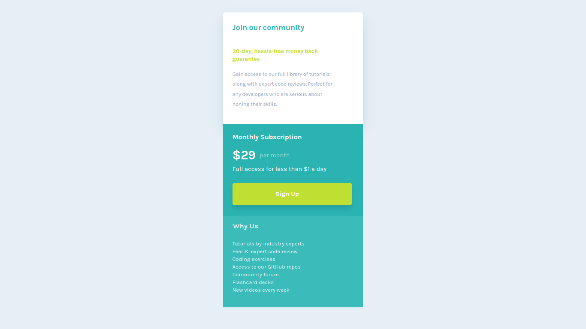
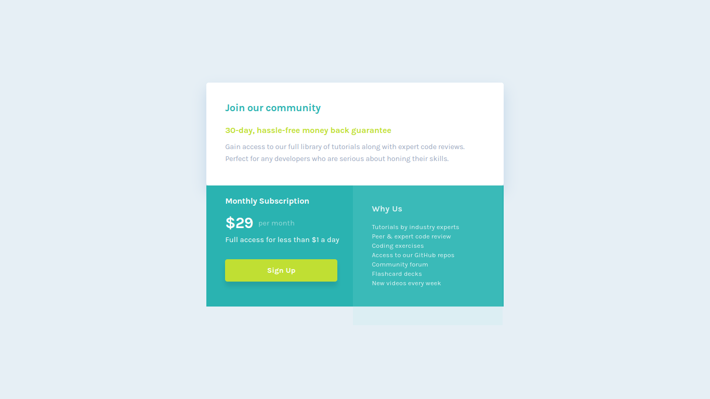

# Frontend Mentor - Single price grid component solution

This is a solution to the [Single price grid component challenge on Frontend Mentor](https://www.frontendmentor.io/challenges/single-price-grid-component-5ce41129d0ff452fec5abbbc). Frontend Mentor challenges help you improve your coding skills by building realistic projects. 

## Table of contents

- [Screenshot](#screenshot)
- [Links](#links)
- [My process](#my-process)
- [Built with](#built-with)
- [Author](#author)
- [Acknowledgments](#acknowledgments)

### The challenge

Users should be able to:

- View the optimal layout for the component depending on their device's screen size
- See a hover state on desktop for the Sign Up call-to-action

### Screenshot

 ## mobile

 ## Desktop

### Links

- [Github](https://github.com/Have-Samuel/social-proof-section)
- [Live Link](https://clever-social-proof.netlify.app/)

## My process

### Built with

- Semantic HTML5 markup
- CSS custom properties
- Flexbox
- CSS Grid
- Mobile-first workflow
- Positioning

## Author

- [Github](https://github.com/Have-Samuel)
- [@Have-Samuel](https://www.frontendmentor.io/profile/Have-Samuel)
- [@samhave1](https://twitter.com/samhave1)
- [LinkedIn](https://www.linkedin.com/in/have-samuel/)

## 🤝 Contributing

Contributions, issues, and feature requests are welcome!

Feel free to check the [issues page](https://github.com/Have-Samuel/social-proof-section/issues).

## Show your support

Give a ⭐️ if you like this project!

## Acknowledgments

- Thanks to Frontend Mentor 🎉
- 👋 Thumbs Up to [@Trekab](https://github.com/trekab?tab=overview&from=2020-12-01&to=2020-12-31)
- etc

## 📝 License

This project is [MIT](./MIT.md) licensed.